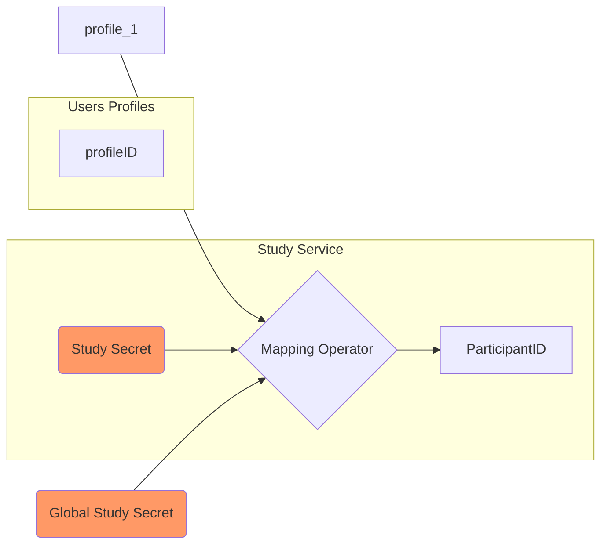

# Study Participants

A Study `Participant` represents an individual (human or not) subject of the survey responses (each response is associated with a `Participant`).

A Participant is associated with a persistant **state** containing the participant's data:

- `participantID`: Uniquely identifies a participant (created using a [Mapping Operator](#participants-mapping-mapping))
- `assignedSurveys`: List of survey the participant can respond to. Each assignation can have a *category* and a validity date range (from, until)
- `status` : Status of the participants in the study (can be `active`, `temporary`,`exited`,`accountDeleted`)
- `enteredDate`: when the participant joined the study
- `flags` : A list of key-values
- `currentStudySession`: The current session the participant is involved into

## Participant Status {#status}

- "active" : The participant is active in the study ()
- "temporary" : for participants without a registered account
- "exited" : participant leaved the study
- "accountDeleted" : the corresponding account has been deleted (not possible anymore to identify the account)

## Participants flags {#flags}

Participants flag allows to define a flag (with a name) and a value (a string) as a dynamic property.
Flags are available in Survey Context during the filling of the response (the flags can be used in survey logic), and in the study rules.

The technical platform does not define any flag, it's up to the team managing the platform to define the flags needed to provide the study and survey logic they want.
Influenzanet Surveillance define some flags to be used with the common survey (see [common-study-definition](https://github.com/influenzanet/common-study-definition))

## Participants Mapping {#mapping}

Link between a user account and a given participant is done using a Mapping Operator

User accounts contains list of profiles, each profile represents a participant, and is associated properties (avatar image and participant nickname considered potentially identifying).

Each profile has a unique ID (hexadecimal string)

The `profile` ID is transformed by the mapping operator to a `participantID`. This operation uses two external parameters:

- A Global Secret (common for all studies of the running platform), defined in the Study service configuration
- A Study secret, specific of a study (and MUST be different across studies)

This ensures:
- A profile is mapped to a unique participant ID for a given study, and will be different for another study (if the study secret is different). Strictly speaking the mapping is not guaranteed to be unique but using an hashing function like SHA256 make the risk of collision (producing the same participantID for two different user's profile) is very unlikely.

Mapping operators are based on common cryptographic operations, making the reverse operation (from `participantID` to `profileID` very difficult, especially if secrets are not known, which is why we call them secret).

Available operators are :
- "same" : identity operator (profileID will be the same as participantID, not obfuscation)
- "aesctr" : AES-256-CTR cipher, can be reversed but poor performance
- "sha224" : SHA2 224 bits (28 octets), will be encoded as hexadecimal string (56 characters)
- "sha224-b64": SHA2 224 bits with base64 URL (38 chars)
- "sha256": SHA2 256 bits, will be encoded as hexadecimal string (64 chars)
- "sha256-b64": SHA2 256bits, encoded with base64 URL (43 chars)

The operator is defined in study configuration, and obviously cannot be changed after participants have been created.

The "same" operator can be used when separation between users' data and participants data are not desired (when enforcing anonymity is not required nor desired).
