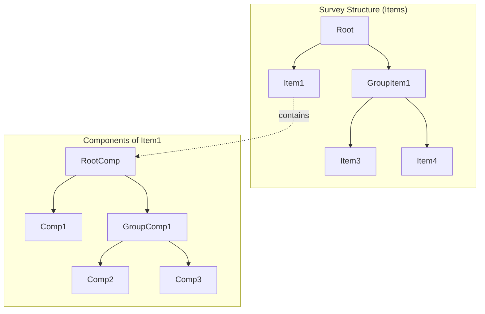
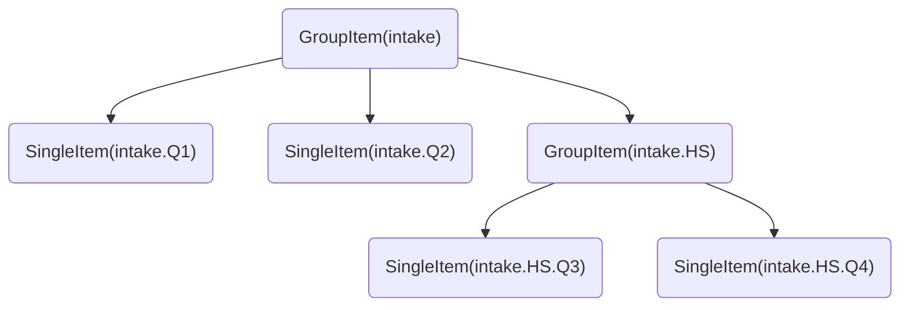

# Survey Definition Structure

## Overview

In this engine, a survey is described as hierarchical structure (a tree) of elements called `Item` (these elements can be a single element, a leaf of the tree, or a group of elements, a node of the survey tree). The leaf are the questions, and each question is composed of a set of components, describing the question content (for display like question label, text or input to collect the data).

The Survey Definition is composed of two kinds of elements:

- `Item`, can be a single item (a "question"), named `SingleItem` or a group of items, named `GroupItem` 
- `ItemComponent` hold by a `SingleItem`, describing the question content. It can also be organized as a tree of component by using `ItemGroupComponent` (see Components)

*Note : in the code the name of the class corresponding for these elements are prefixed by "Survey", giving SurveyItem, SurveyGroupItem...SurveyItemGroupComponent. The prefix is not used here to make the names more readable.*

## Survey Item

An `Item` can be:

- a `SingleItem`, is the logical unit of the survey (usually known as "question"). It can show text, and/or data collection components with more or less complex layouts.
- a `GroupItem` represents a group of Item(s). 

Some remarks about these elements:

`GroupItem` allows to defined a set of items, and for example to make a rule targeting the group (instead of targeting each question in the group individually).
It's a pure structural component, helping to make the survey logic more simple or efficient, it does not affect the way Items are displayed.

A `SingleItem` is a more abstract structure than a "question", concept usually used in other survey engines, it can be purely visual (only to show a text or a title without any field or widget to collect data) or containing several input components (like a sub-form). 

Each kind of Item can react to rules of the survey (see [Survey Engine Logic](#survey-logic)), so you can have a rule to show a single question (targeting a `SingleItem`) or a group of questions (`GroupItem`)

An example of survey Structure will be (the **key** of item in parenthesis), levels represent the items of a group component

### Path into the survey tree and key rules for Item

** Survey Engine Rule **

These rules are mandatory to allow the survey engine to work correctly.

Each `Item` has a key, uniquely identify the item inside the survey. 
They keys of Item elements (`SingleItem` and `GroupItem`) must follow these rules:

- The key is composed by a set of segments separated by a dot (.), root element has only one segment
- The key segments are set of characters WITHOUT dot 
- The key of one Item must be prefixed by the key of it parents.
- All keys must uniquely identify one item 

The key with several segments separated by dots represent the path to this item from the root item. In other words, the key of each item must be the path (dot separated) to this item from the root item. Each dot represent the walk through the lower level. 

Examples:
 - A survey named weekly, with an item Q1:
   - The root item is is keyed 'weekly', 
   - the item is keyed 'weekly.Q1'
 - A survey named weekly with a group of question 'G1', this group containing two questions (SingleItem) Q1 and Q2:
   -  the root item's key is 'weekly'
   -  the group's key is 'weekly.G1'
   -  the item inside the groups have keys respectively 'weekly.G1.Q1', 'weekly.G1.Q2'

** General best practices **

- Key segments should be alphanumerical words, including underscores
- As meaningful as possible
- If a word separator is chosen (dash or underscore) it should be the same everywhere

** Best practices for InfluenzaNet **

Besides the previous naming rules, there are some naming convention, inherited from past platform of Influenzanet

- [should] Items are named with a 'Q' followed by a question identifier (in use Q[nn] and Qcov[nn])
- [must] Last segment of each key must be unique for all the survey. e.g. 'weekly.Q1' must be unique but also 'Q1' in the survey. You must not have another item with a key finishing by 'Q1', even if in another group. This rule because the last segment is used a the key for data export. 
- [must] Question keys are arbitrary but the common questions must have the assigned key in the survey standard definition 
- [should] Non common question, should have a prefix to clearly identify them as non standard question (like a namespace), for example 

## General Properties of Items

GroupItem and SingleItem share some properties controlling some behaviors:

- `key` : uniquely identifying the item inside the survey, and in the response data (used to make a reference to this element anywhere in the system)
- `condition` : the condition field is an It's an [Expression](./expressions), if defined, the item (single or group) is shown if the expression is evaluated to **true** value 
- `follows` : TBD
- `priority`: Number used to defines priority of the question (TDB)

## GroupItem

GroupItem has a special field `selectionMethod`, it allows to defined how order the display order of question is determined inside the group.

To use a sequential order (follow the order of the question as defined in the definition), uses the [Expression](./expressions) named 'sequential'.
If the field is not defined, then the question are ordered randomly (using a uniform random distribution).

## SingleItem

The survey SingleItem is the leaf of our survey tree. It describes a element of the survey, it's composed by a collection of components. Each component can be a text, a data collection widget or other kind of components.
They are described in the [Survey Item](./item)