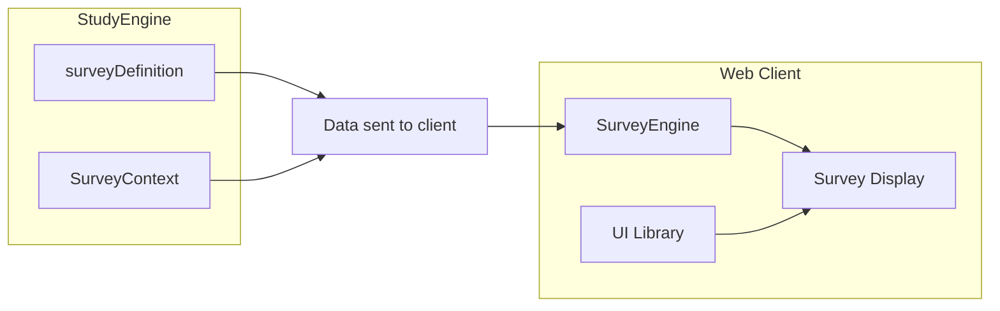

import  { ExpressionViewer } from "@site/src/components/survey";

# Runtime Context

Survey context are data provided alongside with the survey definition when a survey is run by the survey engine.

When the client want to display a survey to be filled by a participant, it will request it from the Study Service (using [Public API](../../system/architecture)).
The Study Service will send two pieces of data : the Survey Definition and the Survey Context.

The Survey Definition contains all the information to display and run the survey for all its possible configurations (all the possible questions and responses regardless if they will be shown or not), the survey context provide information to determine how to configure the survey for the participant.
The survey logic can refer to the data in the context to determine if a question should be shown or not, or if a response should be initialized with response (prefills).

The Survey Context contains the following data:
- list of previous responses to this survey by the participant
- participant flags
- a flag indicating if the user is logged (can be used for public survey)

Previous responses provided in the context are prepared by the Study Service using prefill rules (executed before the survey is sent to the client to be displayed).

In the Survey, [expressions](./expressions) can be used in many places to get and use data from the context, especially participant flags
 
Low levels expressions are:
- `getContext` expression returns the whole context object
- `getAttribute()` can extract a value from its name in an object

By combining these two expression you can access to the context' data.

Fortunately, typescript library case-editor-tools provides some shorthand helpers to directly create expression to test for participant flag values

To test if a flag is set (regardless its value)
<ExpressionViewer name="client:hasParticipantFlag"/>

To test if a flag is set with a given value
<ExpressionViewer name="client:hasParticipantFlagValue"/>

