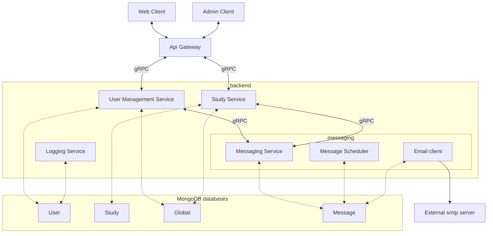

# Architecture Overview

## Backend

Influenzanet platform's backend is based on microservice oriented architecture. Each service manage its own data domain.

Base services are (code are in [repositories page](./repositories)):

- User Management Service : handles users account and authentication 
- Study Service : handles study (survey, response, participants)
- Messaging Service : manages messages (email)
- Logging Servicer : manages logs of users' actions

Each service use its own MongoDB database. A special database name globalDB is shared by some services to manage common entities (available instances for example).

## Multi tenant organization and instances {#instances}

Databases are organized to allow multi-tenant organization.

2 levels are used:
    - Static : A service is connected to a fixed database namespace, using a database `prefix`
    - Dynamic : A Service can manage several `instances`, each instance is using its own MongoDB database, determined for each request to the service (instance Id is provided with the request).

globalDB contains an `instances` collection determining the known instances 

Each database name is constructed using the following schema:

    [prefix][instance]_[dbName] 

For example, for the namespace `prod` (using prefix "prod_" ), instance 'italy',  userDB will be `prod_italy_users`

Except for global DB, wich is share across instances, and has only prefix

    [prefix]global-infos

Example: prod_global-infos (using prefix "prod_")

Prefix can be used to differentiate environments (like production/test, ..) and instances for tenants.

For example, if several countries participant, each country can have its own instance and share the services of the same cluster. Be aware that in this case the database credentials will be the same (an db account will manage all the instances databases of this service).

Database names (without prefix/instance):
 - `users` : User service Database (used by Logging service too), often refered as UserDB
 - `messageDB` : Messaging service Database
 - `studyDB` : Study service database

## Technical choices:

### Database

The Influenzanet backend is using MongoDB to store data.

Influenzanet surveillance data analysis are done using PostgreSQL database

### Microservices

Microservices are written in [golang](https://go.dev/)

### Clients

Web client are built using [React](https://react.dev/) with typescript flavor.

Administration tools (command line) are using Python
