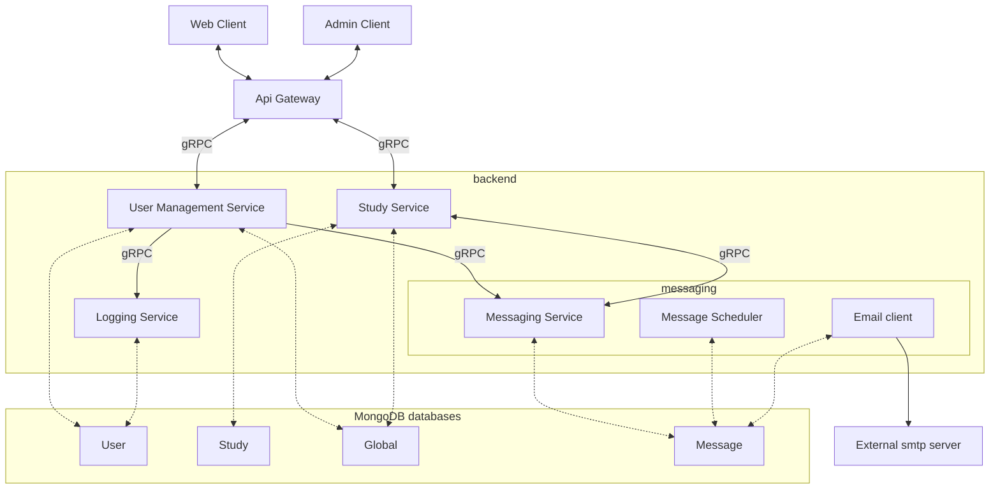

# Architecture Overview

## Backend

The backend of the Influenzanet platform is based on microservices-oriented architecture. Each service manages its own data domain.

the basic services are (code is in [repositories page](./repositories)):

- User Management Service : handles user account and authentication 
- Study Service : handles study (survey, response, participants)
- Messaging Service : handles messages (email)
- Logging Servicer : handles logs of users' actions

Each service uses its own MongoDB database. A special database called the globalDB is shared by some services to manage common entities (e.g. available instances).

## Multi-tenant organization and instances {#instances}

Databases are organised to allow multi-tenant feature.

2 levels are used:
    - Static : A service is connected to a fixed database namespace, using a database `prefix`
    - Dynamic : A service can manage several `instances`, each instance is using its own MongoDB database, determined for each request to the service (instance id is provided with the request).

The globalDB contains an `instances` collection that defines the known instances by the system.

Each database name is constructed using the following schema:

    [prefix][instance]_[dbName] 

For example, for the namespace `prod` (using the prefix "prod_" ), instance 'italy',  userDB will be `prod_italy_users`

Except for the global DB, wich is shared across instances, and has only the common prefix

    [prefix]global-infos

Example: prod_global-infos (using prefix "prod_")

The prefix can be used to differentiate environments (such as production/test, ..) and instances for tenants.

For example, if several countries participant are involved, each country can have its own instance and share the services of the same cluster. Note that in this case the database credentials will be the same (a single MongoDB user account will manage the databases of all the instances).

Database names (without prefix/instance):
 - `users` : User service Database (used by Logging service too), often refered as UserDB
 - `messageDB` : Messaging service Database
 - `studyDB` : Study service database

## Technical choices:

### Database

The Influenzanet backend is using MongoDB to store data.

Influenzanet surveillance data analysis are done using PostgreSQL database

### Microservices

Microservices are written in [golang](https://go.dev/)

### Clients

Web client are built using [React](https://react.dev/) with typescript flavor.

Administration tools (command line) are using Python
