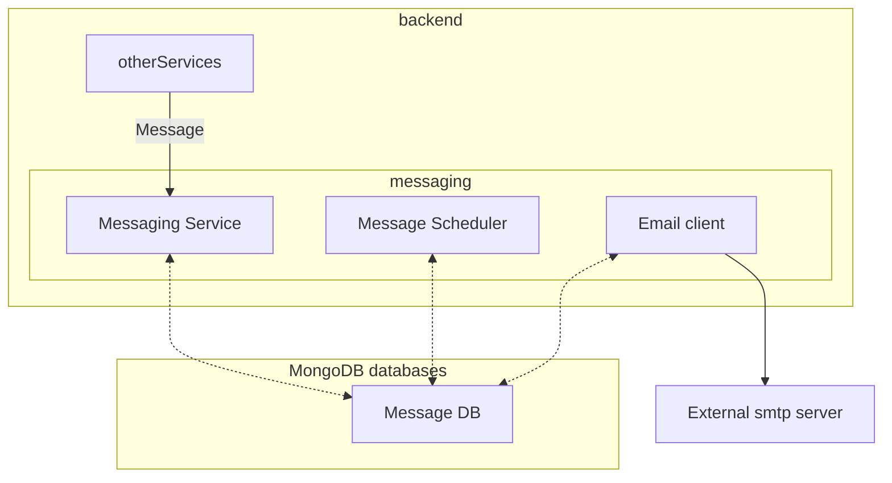

# Messaging service

The messaging service is responsible of preparing and sending messages outside the plateform to participants or to the team managing the plateform.

Several types of messages are handled by the platform:

- System messages : these messages are sent when some event occured in the platform, mainly for account management purposes (email validation, renew password, ...). They are using a prepared configurable templates. They are mostly transactional messages.

- Auto Messages : Messages used to send informational contents to the participants, for example weekly reminder, newsletter, specific messages about a study. They can be configured with some sending strategies such as periodic triggering, targeting a subset of participants (based on participant flags).

- Researcher/Participants messages

## Architecture

The Messaging service is organized in several components:

- The message service, receives the sending order from other services.
- The Message scheduler, periodically checks for message to send and their condition, if it matches prepare the messages for each targetted user and store it in the sending queue (collection 'outgoing_messages')
- The Email Service, takes each message in the queue and send it

The following graph represents the Messaging Service organization. Other services are represented as a unique entity but can be multiple (Study service, User...). The SMTP server is not handled by the system but represents the endpoint to actually send email
outside the platform (using corporate infrastructure or an external service like MailGun, Sending blue, ...)



## Message Types

### System messages

- `registration`: when a new account is created, this message will be sent to the used email address. This message should include link to email verification route including the token (see below).
- `invitation`: this email is sent out when a user account was created by an admin. This message should include link to invite link route including the token (see below).
- `verify-email`: if a user requests a new verification email, or in case the email address is changed in the application, this email will be sent out. Should also contain the specific link for email verification.
- `password-reset`: after triggering the password reset workflow, this email-template will be used. Should contain link with url toward the password reset link resolver of the web-client, including the appropriate token (see below).
- `verification-code`: After login, the user will receive this message, that should include the 6 digit numeric code prominently.
See below how to access the variable.
- `password-changed`: after a successful password change, the user will receive an email about the event.
- `accound-id-changed`: when a user changes the email address in the application, this message will be sent to the *old* email address. Can be used to warn about potential inappropriate access, or tell the user to use the new email to login.
- `account-deleted`: as a last contact, this message will be sent out to confirm the successful account deletion.

### Auto Messages (or Bulk messages)

Bulk messages allow to send the same message to all or a subgroup of users.
A bulk message associates:
- A type of sending : all-users, study-participants
- If study-participants, a condition on the participant state (such as a expression testing flags values)
- A Message template : with a message Type and template text 


The types of message templates can be:

- `weekly`: to send regular weekly reminder / summary for users/participants - typically with a link to the study page, including a login token, to automatically confirm email possession.
- `study-reminder`: to send occasional reminder that a survey in a specific study is available - typically with a link to the study page, including a login token, to automatically confirm email possession.
- `newsletter`: send regular or irregular news-like emails to the users / study participants - this does not contain a login token, just informations, and possibly links to the result pages.

### Message templates

Most of the messages are installed into the platform as *template* used to generate the final message for a given user. These template can contain(sometimes are expected to contain) placeholders that will be replaced by the actual value when the message is generated for a given user.

These placeholders, commonly called template variables are using golang template syntax :

```
{{ index . "your-variable-name" }}
```

The double '{{' and '}}' respectively mark the start and the end of the variable placeholder and between them the expression referencing the value to put in this place. It's always starting with `index.` as all values are provided in a record named 'index', you should not remove it. The name of the value to put must be quoted by double quote.

Several names are defined and can be used in some templates (they are **case sensitive**)

- `loginToken`: can be used to verfiy possession of the email address (one factor in the multi step login).
- `verificationCode`: 6 digit verification code (one factor of the multi step login).
- `studyKey`: key of the study, we sending out the message for.
- `unsubscribeToken`: can be used to unsubscribe from newletter
- `token`: random token string, that can be used to access the system - generated by the user-management for a specific purpose.
- `language`: user's preferred language selection.

For example, `{{index."loginToken"}}` represents the value of the login token.
Beware to use the exact name (with the same case, the names are **case sensitive**)

Not all variables are available for all the template.

It's also possible to use link, the predefined links are (between `<name>` the simplified syntax for placeholder `name`)

- `/link/study-login?token=<loginToken>&study=<studykey>` - use this link to open the study page directly.
- `/link/verify-contact?token=<token>`: - use this link to confirm email address, e.g., after registration or when the email address has been changed.
- `/link/password-reset?token=<token>`: at this link with the appropriate token, the password reset workflow is triggered (you verified possession of the email address).
- `/link/invitation?token=<token>`: this link is to confirm the invitation - verifying email address and starting password reset workflow.

To work, those links must be preceded by the full web site address of your platform in the template and you must use the full syntax {{index."name"}} 

For example, if your platform is 'https://app.influenza.net', the links to put in the templates will be

- https://app.influenza.net/link/study-login?token={{index."loginToken"}}&study={{index."studyKey"}}
- https://app.influenza.net/link/verify-contact?token={{index."token"}}
- https://app.influenza.net/link/password-reset?token={{index."token"}}
- https://app.influenza.net/link/invitation?token={{index."token"}}

## Sending Strategies for Bulk Messages

The Bulk message associates a sending type and a message type (in then message templates), and both drive the sending strategy and the variables available in templates.

The features available are determined by combination of Automessage type and Message Type are describred it the following table.

| AutoMessage  Type | Message Type   | Subscription | WeekDay      | LoginToken  | UnsubscribeToken |
|-------------------|----------------|--------------|--------------|-------------|------------------|
| all-users         |                |              |              |             |                  |
|                   | weekly         | Weekly       | Yes (forced) | Yes         | No               |
|                   | study-reminder | No           | No  (forced) | Yes         | No               |
|                   | newsletter     | Newsletter   | Customizable | No          | Yes              |
| study-participants|                |              |              |             |                  |
|                   | weekly         | Weekly       | Yes (forced) | Yes (1)     | No               |
|                   | study-reminder | No           | No  (forced) | Yes (1)     | No               |
|                   | newsletter     | Newsletter   | Customizable | Yes (1)     | Yes              |

Note (1) : Regardless the message type, the login token is used for Automessage type 'study-participants' 

- `Subscription` : User can subscribe to receive this message for this category, only subscribers will recevive the message
- `WeekDay`: Use of weekday allocation to select target users
- `LoginToken`: Login token vaiable is available in template
- `UnsubscribeToken`: Unsubscribe token allow to use a direct unsubscribe link in the template

The message type is driven some behaviour, like the usage of the weekday allocation to send message (only participants allocated on a weekday will receive the message when sent on this day of week). It's important in this case that the message
is configured to be sent using a daily period on all allocated weekdays.

For example, it's commonly to configure a weekly message to be sent with a period of 1 day (86400 seconds) from the monday to the next sunday to be sure that all particpants will receive the messages.
The weekday allocation is done randomly but it is possible to configure the weight of allocation for each day, allowing to control how week days are allocated (or not allocated to a week day if its weight is set to 0).
